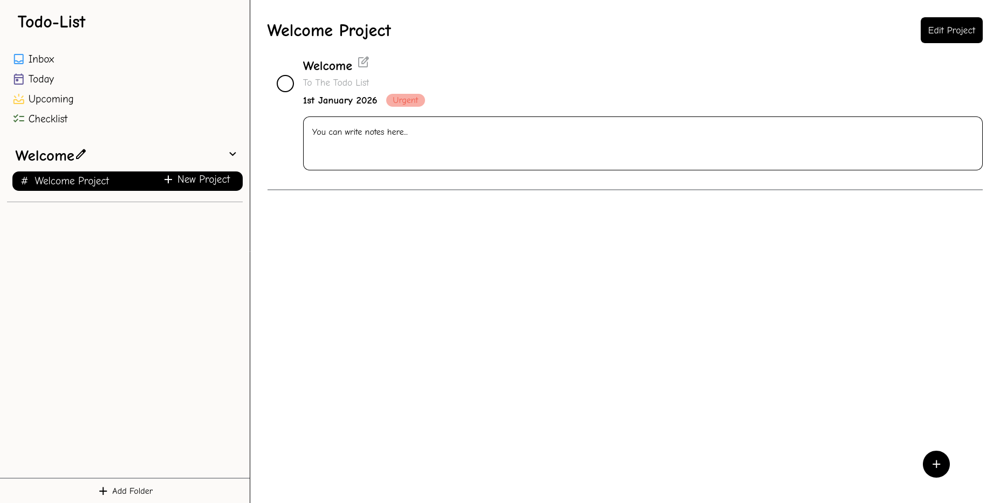

# Todo-List

A simple Todo-List with folders, projects and tasks to make and complete.

**Link to project:** https://defalterxd.github.io/Todo-List/

## How It's Made

**Tech used:** HTML, CSS, JavaScript, Webpack

For this project I used webpack merger for two separate configuration to build and dev environment. Then make a mockup in another branch to see how my website would look.

After the make up I started to build my website through the JavaScript to render but the problem is because I started first to render I couldn't figure out how to 'add', 'edit' and 'remove' my categories and handle the 'Inbox', 'Today', 'Upcoming' and 'Checklist' to view. So because of that I started from scratch in console and build it up from upward. So the logic would be more easier to handle therefore I implemented all my functions properly.

And lastly after I make sure my website is working I refactor my code a little bit to handle a local storage when the manipulations with any of my tasks, projects and folders would be save and safely retrieve to render on reload.

## Lesson Learned:

<ul>
    <li>How to set up a webpack merger</li>
    <li>Using 'Single-responsibility' rule from SOLID(and other rules in my current best abilities)</li>
    <li>Read documentation of new installed package 'date-fns' and implement it</li>
    <li>Make a use of local storage to handle my page when reload</li>
    <li>Manipulate with JSON methods to use for local storage</li>
    <li>And add a little bit of animation for dynamic</li>
</ul>

## References:

All icons and fonts was from [Google fonts](https://fonts.google.com/)
